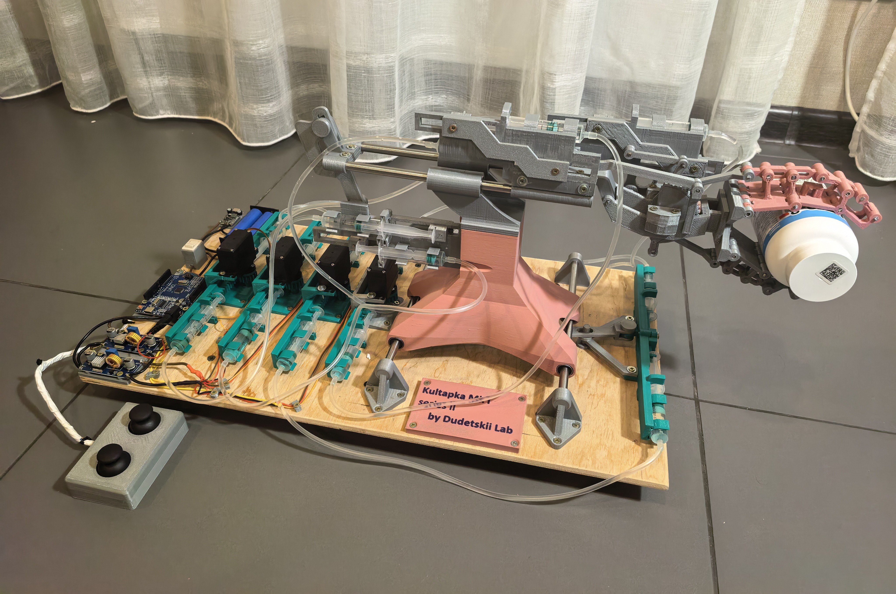
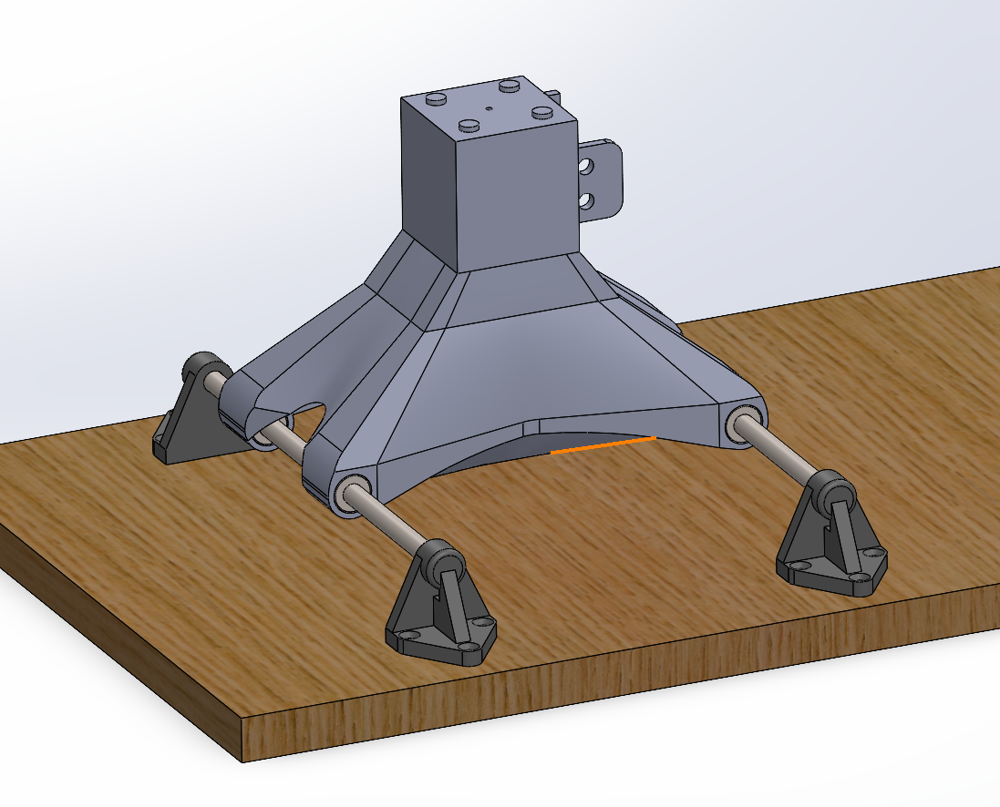
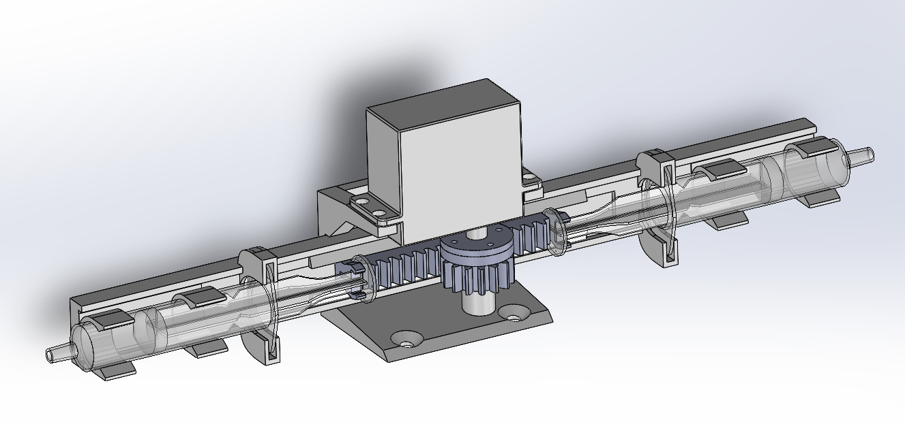
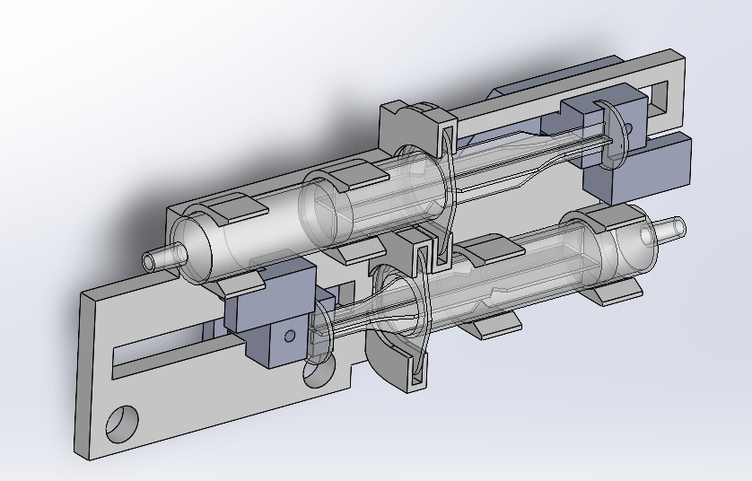
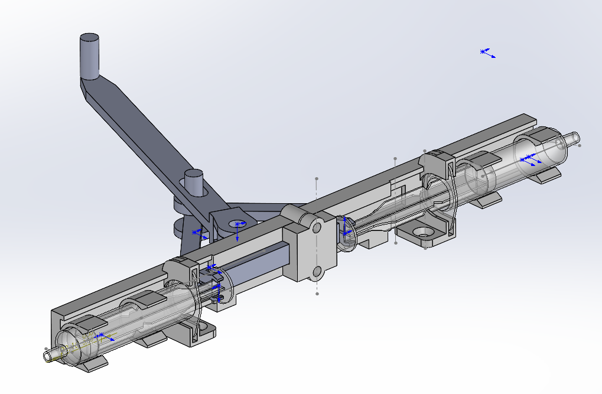
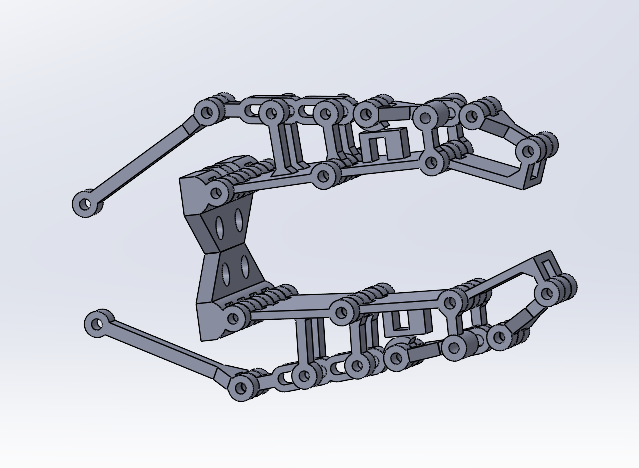

# Отчёт по разработке робототехнического манипулятора с гидравлическим приводом

## 1. Введение

В рамках инженерной подготовки была выполнена разработка робототехнического манипулятора, соответствующего заданной кинематической схеме. Проект охватывал полный цикл инженерной разработки: от анализа кинематики и концептуального проектирования до изготовления, сборки, электроники и программного управления.

Ключевой особенностью проекта является **использование полностью гидравлической системы привода**, реализованной на базе доступных компонентов и аддитивных технологий, что позволило исследовать альтернативные решения по сравнению с классическими электрическими и механическими приводами.

---

## 2. Цель и задачи работы

### 2.1 Цель работы

**Создание функционирующего робототехнического манипулятора, соответствующего заданной кинематической схеме, с использованием гидравлических приводов и электронного управления.**

---

### 2.2 Задачи работы

Для достижения поставленной цели в рамках проекта были решены следующие задачи:

1. Анализ заданной кинематической схемы манипулятора.
2. Разработка концепции механической реализации степеней свободы.
3. Исследование и сравнение различных типов приводов и передач.
4. Проектирование гидравлической системы привода.
5. Разработка механических узлов: кареток, направляющих, вращательных осей.
6. Проектирование и изготовление захватного устройства.
7. Изготовление деталей методом 3D-печати.
8. Разработка электрической схемы управления.
9. Реализация программного управления манипулятором.
10. Интеграция системы управления с клавиатурой и джойстиком.
11. Проведение финальных испытаний и анализа полученного результата.

---

## 3. Анализ кинематической схемы

На первом этапе был выполнен анализ заданной кинематической схемы манипулятора. Были определены:

* количество степеней свободы;
* типы кинематических пар (поступательные и вращательные);
* пространственное расположение осей;
* требования к диапазонам перемещений.

Анализ показал необходимость:

* реализации линейных перемещений с высокой плавностью;
* обеспечения вращательной степени свободы с достаточной жёсткостью;
* компактного и универсального схвата.

Результаты анализа легли в основу выбора конструктивных решений на последующих этапах.

---

## 4. Создание концепта и выбор механических решений

### 4.1 Концепция линейных перемещений

Для реализации поступательных степеней свободы были рассмотрены два варианта:

1. **Перемещение по направляющим с линейными подшипниками**
2. **Скользящее перемещение в пазах с сухим трением**

В ходе анализа и предварительных испытаний было установлено, что вариант с сухим трением:

* обладает повышенным сопротивлением движению;
* быстро изнашивается;
* снижает точность и повторяемость перемещений.

**Итоговое решение:**
Выбран вариант с **направляющими из нержавеющей стали и линейными подшипниками**, обеспечивающий минимальное трение, высокую плавность и долговечность.

---

### 4.2 Выбор типа привода

Были рассмотрены следующие типы приводов:

* ремённая передача;
* винтовая передача;
* реечная передача;
* гидравлический привод.

#### Сравнение вариантов:

| Тип привода    | Преимущества                                 | Недостатки             |
| -------------- | -------------------------------------------- | ---------------------- |
| Ремённый       | Простота, скорость                           | Люфты, растяжение      |
| Винтовой       | Точность                                     | Сложность, трение      |
| Реечный        | Жёсткость                                    | Шум, износ             |
| Гидравлический | Большая сила, плавность, гибкость компоновки | Сложность герметизации |

**Итоговое решение:**
Выбран **гидравлический привод**, так как он:

* обеспечивает высокую выходную силу;
* позволяет легко преобразовывать вращательное движение в линейное;
* допускает вынесение приводов на расстояние от исполнительных механизмов;
* подходит для потенциальной работы в опасных условиях (радиация, загрязнения).

---

## 5. Разработка гидравлической системы

### 5.1 Комбинированные варианты

На ранних этапах рассматривались гибридные решения:

* гидравлика + механическая передача;
* гидравлика + тросовая передача.

Однако они показали:

* усложнение конструкции;
* рост люфтов;
* снижение надёжности.

### 5.2 Полностью гидравлическая система

В результате было принято решение о реализации **полностью гидравлической системы**.

---

### 5.3 Выбор конфигурации гидроцилиндров

Рассматривались два варианта:

1. **Одноцилиндровая система**
2. **Двуцилиндровая система**

В ходе тестирования было установлено, что:

* одноцилиндровая система имеет неравномерное распределение усилий;
* двуцилиндровая система обеспечивает лучшую симметрию, устойчивость и плавность.

**Итог:** выбран **двуцилиндровый вариант**.

---

### 5.4 Разработка гидронасоса

Из-за невозможности напечатать герметичный цилиндр на используемом 3D-принтере было принято инженерное решение:

* использовать **медицинские шприцы** как готовые герметичные гидроцилиндры.

Был разработан **двуцилиндровый гидронасос на основе шприцов**, обеспечивающий:

* надёжную герметизацию;
* простоту изготовления;
* повторяемость параметров.

---

## 6. Проектирование механических узлов

### 6.1 Каретки и направляющие

Были разработаны:

* подвижные каретки;
* узлы крепления направляющих;
* посадочные места для линейных подшипников.

Особое внимание уделялось:

* жёсткости конструкции;
* минимизации перекосов;
* простоте сборки и обслуживания.

---

### 6.2 Линейные гидромоторы

Для каждой линейной оси были разработаны гидравлические приводы, передающие усилие напрямую на каретки, что позволило отказаться от промежуточных механических передач.

---

### 6.3 Вращательная ось

Первая версия вращательной оси показала:

* избыточную подвижность;
* наличие люфтов под нагрузкой.

После анализа была разработана **упрощённая и более жёсткая конструкция с одной тягой**, обеспечивающая:

* снижение люфтов;
* повышение надёжности;
* упрощение сборки.

---

## 7. Проектирование захватного устройства

### 7.1 Анализ типов захватов

Были рассмотрены:

* параллельные захваты;
* клещевые захваты;
* вакуумные захваты;
* антропоморфные захваты.

### 7.2 Выбор антропоморфного захвата

Был выбран **антропоморфный тип захвата**, так как он:

* универсален;
* способен захватывать объекты сложной формы;
* адаптируется к различным размерам и геометрии объектов.

---

### 7.3 Концепция сухожилий и фаланг

Захват был реализован на основе:

* фалангов пальцев;
* сухожильной передачи усилия.

Это позволило:

* равномерно распределять усилие;
* обеспечить адаптивность захвата.

---

### 7.4 Планетарная передача

Для передачи усилия от гидронасоса к захвату была разработана **планетарная передача**, обеспечивающая:

* компактность;
* соосность конструкции;
* эффективное распределение момента на нижнюю и верхнюю части cхвата.

---

## 8. Изготовление и сборка

### 8.1 Прототипирование

На этапе прототипирования:

* выполнялась печать отдельных модулей;
* производилась подгонка тяг и подвижных элементов;
* неудачные образцы перепечатывались.

### 8.2 Финальная сборка

После доработки всех элементов была выполнена **финальная сборка механической части манипулятора**.

---

## 9. Электроника и питание

### 9.1 Начальная схема

Изначально использовалось питание от Arduino, однако было выявлено, что:

* напряжение и ток недостаточны для питания серводвигателей.

### 9.2 Раздельное питание

Было реализовано раздельное питание:

* Arduino;
* серводвигателей.

С использованием **двух понижающих DC-DC преобразователей**.

---

### 9.3 Аккумуляторная система

В систему были добавлены:

* литий-ионные аккумуляторы 18650;
* модуль зарядки с BMS;
* выключатель питания.

После этого была выполнена окончательная пайка схемы.

---

## 10. Программное обеспечение

### 10.1 Управляющий скетч Arduino

Был разработан скетч, который:

* обеспечивает непрерывное вращение моторов при наличии управляющего сигнала;
* мгновенно останавливает движение при отсутствии сигнала, что повышает безопасность.

---

### 10.2 Управление с компьютера

Был создан Python-скрипт для:

* передачи команд через COM-порт;
* управления манипулятором с клавиатуры.

---

### 10.3 Управление джойстиком

После этого:

* была разработана модель управления джойстиком;
* скетч Arduino был переписан для поддержки модуля KY-023.

---

## 11. Использованные компоненты

### Механика и гидравлика

* 4 серво-привода MG945-360
* 4 направляющие из нержавеющей стали (220 мм, Ø8 мм)
* 4 линейных подшипника LM8UU
* 4 линейных подшипника LM8-L-UU (8×15×45 мм)
* 16 шприцов по 5 мл
* Медицинские капельницы (в качестве гидравлических шлангов)
* Пластик PLA

### Электроника

* Arduino UNO
* 2 понижающих DC-DC преобразователя LM2596S
* Модуль зарядки Li-ion аккумуляторов с BMS
* Модуль двухосевого джойстика KY-023
* 2 Li-ion аккумулятора 18650 (3.7 В)

---

## 12. Итоговые испытания

В ходе финальных тестов было подтверждено:

* работоспособность всех степеней свободы;
* корректность гидравлической системы;
* устойчивость конструкции под нагрузкой;
* удобство управления с клавиатуры и джойстика.

---

## 13. Выводы и направления улучшения

### Выводы:

* Цель работы была полностью достигнута.
* Создан функционирующий манипулятор, соответствующий заданной кинематической схеме.
* Гидравлический привод показал свою эффективность и перспективность.
* Использование доступных компонентов позволило реализовать сложную систему с минимальными затратами.

### Возможные улучшения:

* внедрение датчиков положения и давления;
* реализация замкнутых контуров управления;
* повышение точности позиционирования;
* использование более прочных материалов;
* переход к промышленным гидравлическим компонентам.

---

